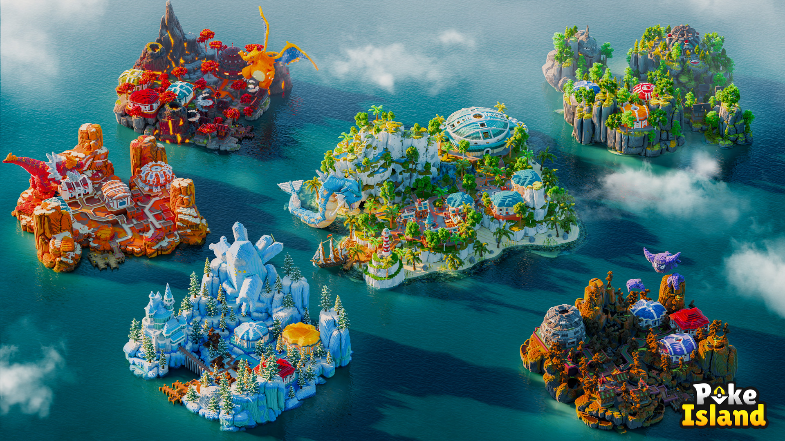

# Maintenance wiki

<h2 align="center">Bienvenue sur le Wiki de <mark style="color:$primary;"><strong>PokeIsland</strong></mark></h2>


Notre wiki est en cours de maintenance, merci pour votre compréhension il arrive très vite.


<figure><figcaption></figcaption></figure>
