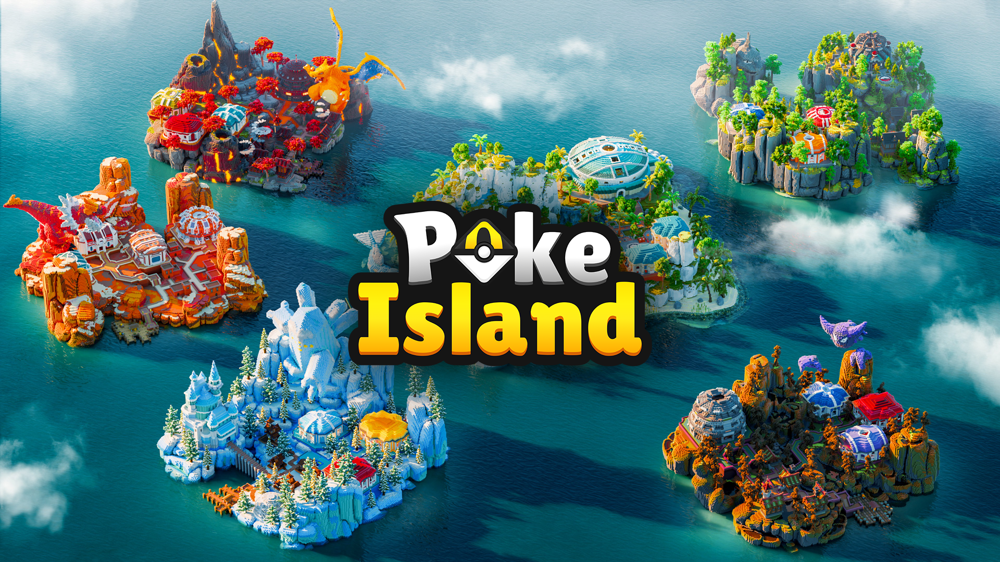

# Bienvenue

## Bienvenue sur <mark style="color:$primary;">**PokeIsland**</mark>

<mark style="color:$info;">Retrouve toutes les informations clés pour progresser et découvrir PokeIsland.<mark style="color:$info;">

PokeIsland est un serveur francophone sur **Minecraft Java Edition**, basé sur le mod **Cobblemon**. Capture, entraîne et fais évoluer tes Pokémon dans un monde unique.

<table data-view="cards"><thead><tr><th></th><th></th><th data-hidden data-card-target data-type="content-ref"></th><th data-hidden data-card-cover data-type="image">Cover image</th></tr></thead><tbody><tr><td><strong>Jouer</strong></td><td>Téléchargement et installation</td><td><a href="informations/telechargement/">telechargement</a></td><td><a href=".gitbook/assets/jouer-wiki.png">jouer-wiki.png</a></td></tr><tr><td><strong>Apprendre à jouer</strong></td><td>Premier pas &#x26; tutoriel</td><td><a href="tutoriel/premier-pas.md">premier-pas.md</a></td><td><a href=".gitbook/assets/decouvrir-wiki.png">decouvrir-wiki.png</a></td></tr><tr><td><strong>Cobblemon</strong></td><td>Tout connaître du mod officiel</td><td><a href="https://wiki.cobblemon.com/index.php/Main_Page">https://wiki.cobblemon.com/index.php/Main_Page</a></td><td><a href=".gitbook/assets/cobblemon-wiki.png">cobblemon-wiki.png</a></td></tr></tbody></table>

***

### Découvrir PokeIsland

<mark style="color:$info;">Tu souhaites découvrir tout l'univers avec les fonctionnalités du serveur, tu es au bon endroit !<mark style="color:$info;">




<figure><figcaption></figcaption></figure>




<table data-card-size="large" data-view="cards"><thead><tr><th></th><th></th><th data-hidden data-card-target data-type="content-ref"></th></tr></thead><tbody><tr><td><strong>Dresseur</strong></td><td>Niveaux, récompenses et déblocages</td><td><a href="pokeisland/dresseur.md">dresseur.md</a></td></tr><tr><td><strong>Rangs</strong></td><td>Débloque de nouvelles compétences</td><td><a href="pokeisland/rangs.md">rangs.md</a></td></tr><tr><td><strong>PokéWorld</strong></td><td>Les îles, arènes, safaris et bien d'autre encore</td><td><a href="pokeisland/pokeworld/">pokeworld</a></td></tr><tr><td><strong>Ressources</strong></td><td>Récolter et explore les ressources du monde</td><td><a href="pokeisland/ressources/">ressources</a></td></tr><tr><td><strong>Île joueurs</strong></td><td>Ta propre île pour ton aventure Pokémon</td><td><a href="pokeisland/ile-joueurs.md">ile-joueurs.md</a></td></tr><tr><td><strong>Économie</strong></td><td>GTS, marchands, enchères et shop</td><td><a href="pokeisland/economie/">economie</a></td></tr><tr><td><strong>Arènes</strong></td><td>Champions, paliers et badges</td><td><a href="pokeisland/pokeworld/arenes.md">arenes.md</a></td></tr><tr><td>Safaris</td><td>Zone de capture ou d'entrainement</td><td><a href="pokeisland/pokeworld/safari.md">safari.md</a></td></tr></tbody></table>




***

### Informations utiles

<mark style="color:$info;">Tout ce qui concerne le serveur, l'équipe et la communauté.<mark style="color:$info;">

<table data-view="cards"><thead><tr><th></th><th></th><th data-hidden data-card-target data-type="content-ref"></th></tr></thead><tbody><tr><td><strong>Règlement</strong></td><td>Les règles à respecter sur le serveur</td><td><a href="informations/reglement-officiel.md">reglement-officiel.md</a></td></tr><tr><td><strong>Notre équipe</strong></td><td>Les membres qui font vivre le projet avec la communauté</td><td><a href="informations/notre-equipe.md">notre-equipe.md</a></td></tr><tr><td><strong>Liens utiles</strong></td><td>Discord, boutique, réseaux et plus</td><td><a href="informations/liens-utiles.md">liens-utiles.md</a></td></tr><tr><td><strong>FAQ</strong></td><td>Les questions les plus fréquentes</td><td><a href="informations/faq.md">faq.md</a></td></tr><tr><td><strong>Vote &#x26; gagne</strong></td><td>Soutiens le serveur et récolte des récompenses</td><td><a href="tutoriel/vote-and-gagne.md">vote-and-gagne.md</a></td></tr><tr><td><strong>Contribuer</strong></td><td>Participe à l'amélioration du wiki</td><td><a href="informations/contribuer.md">contribuer.md</a></td></tr></tbody></table>
