# Pokémon Éclipse 2026

Arcanin Éclipse

<figure>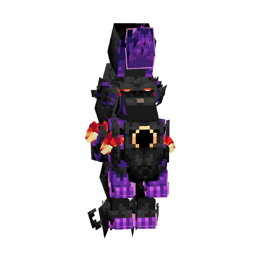<figcaption></figcaption></figure>

Branette Éclipse

<figure>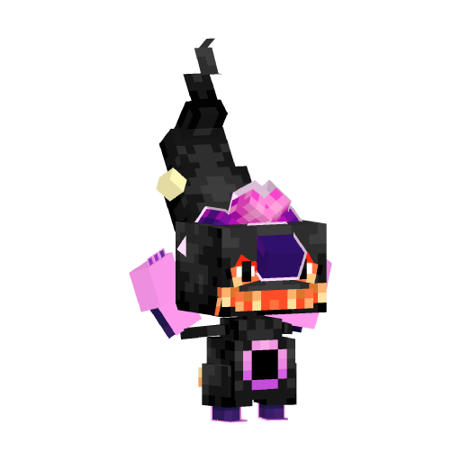<figcaption></figcaption></figure>

Bulbizarre Éclipse

<figure>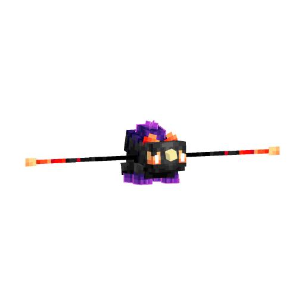<figcaption></figcaption></figure>

Carchacrok Éclipse

<figure>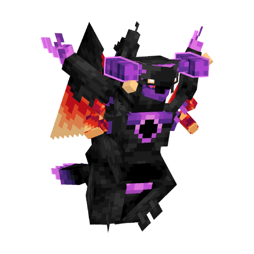<figcaption></figcaption></figure>

Desséliande Éclipse

<figure>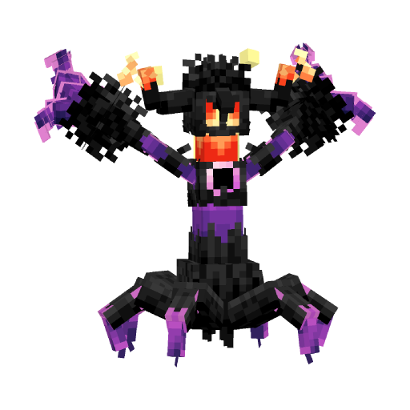<figcaption></figcaption></figure>

Dracolosse Éclipse

<figure>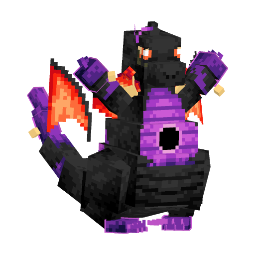<figcaption></figcaption></figure>

Ectoplasma Éclipse

<figure>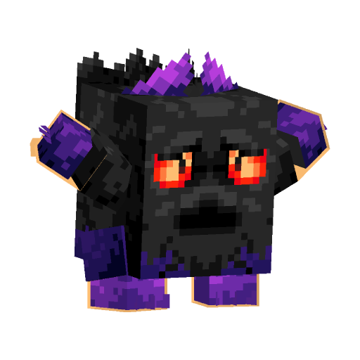<figcaption></figcaption></figure>

Giratina Éclipse

<figure>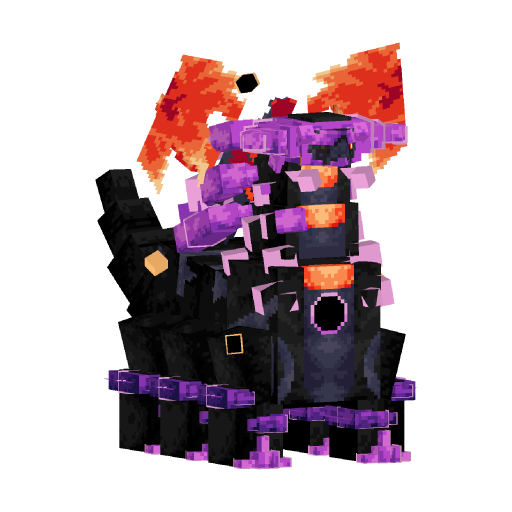<figcaption></figcaption></figure>

Hélédelle Éclipse

<figure>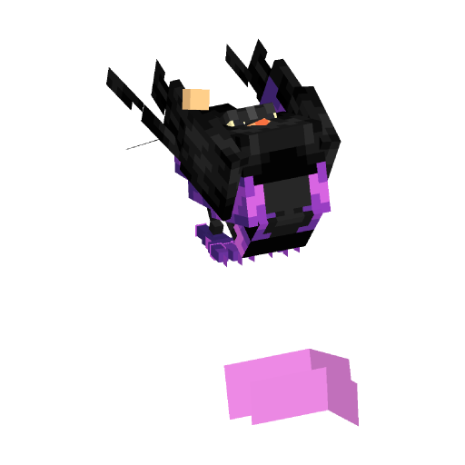<figcaption></figcaption></figure>

Héricendre Éclipse

<figure>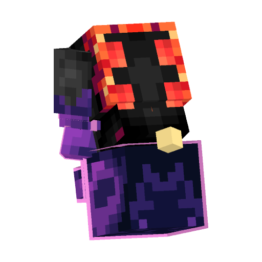<figcaption></figcaption></figure>

Jungko Éclipse

<figure>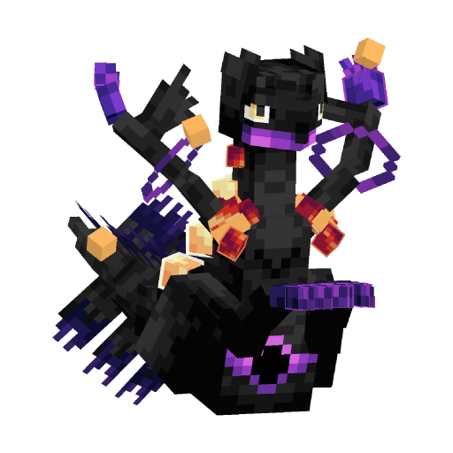<figcaption></figcaption></figure>

Lugulabre Éclipse

<figure>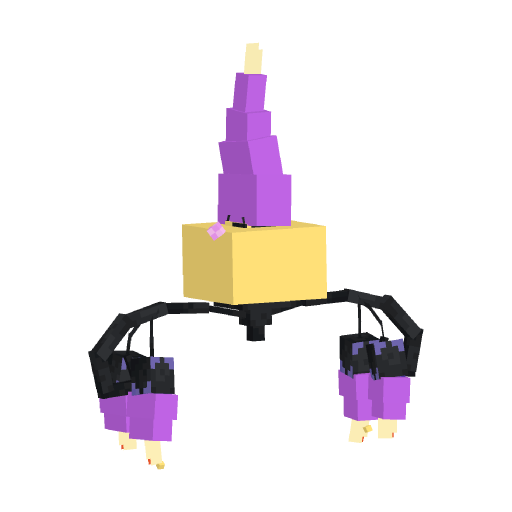<figcaption></figcaption></figure>

Magirêve Éclipse

<figure>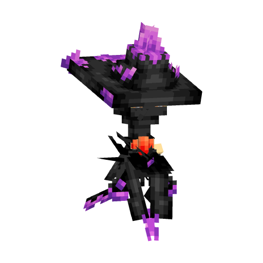<figcaption></figcaption></figure>

Malvalame Éclipse

<figure>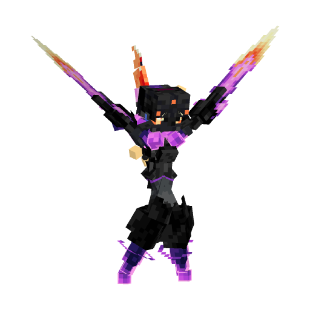<figcaption></figcaption></figure>

Mentali Éclipse

<figure>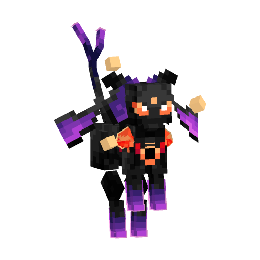<figcaption></figcaption></figure>

Mewtwo Éclipse

<figure>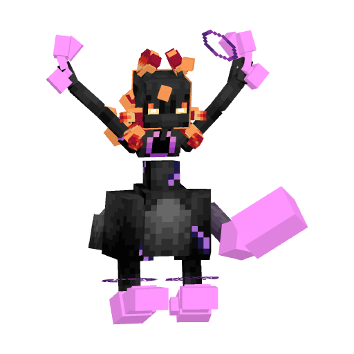<figcaption></figcaption></figure>

Mimiqui Éclipse

<figure>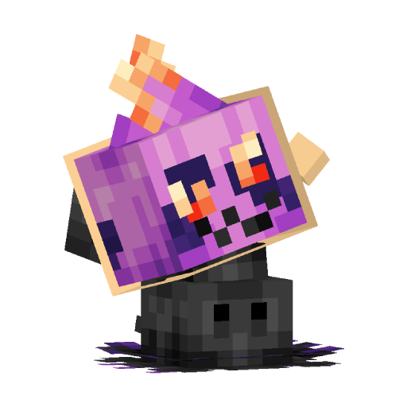<figcaption></figcaption></figure>

Pingoléon Éclipse

<figure>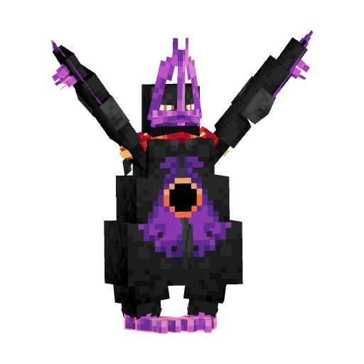<figcaption></figcaption></figure>

Psykokwak Éclipse

<figure>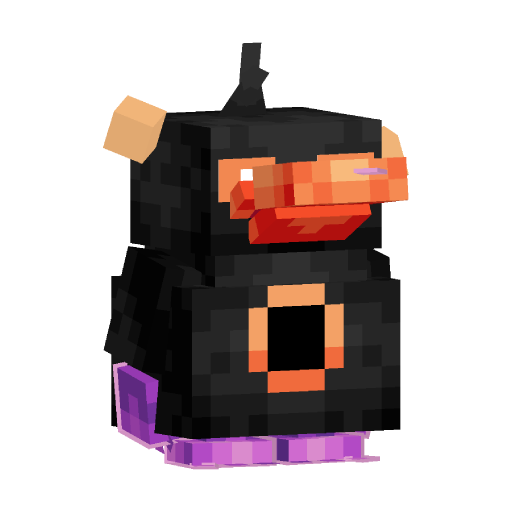<figcaption></figcaption></figure>

Scorvol Éclipse

<figure>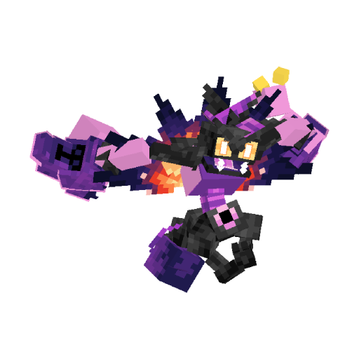<figcaption></figcaption></figure>

