# Pokémon Été 2026

Amphinobi d'Été

<figure>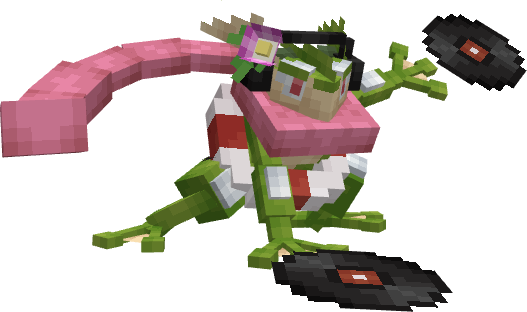<figcaption></figcaption></figure>

Bekipan d'Été

<figure>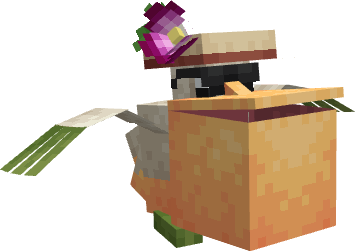<figcaption></figcaption></figure>

Dracaufeu d'Été

<figure>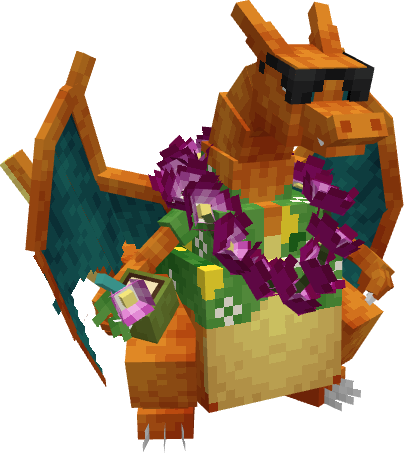<figcaption></figcaption></figure>

Fragilady d'Été

<figure>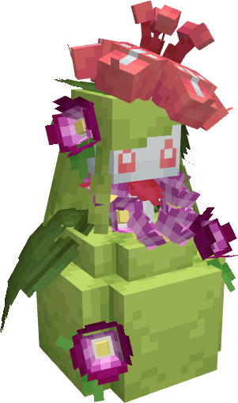<figcaption></figcaption></figure>

Gardevoir d'Été

<figure>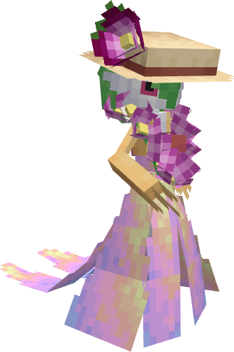<figcaption></figcaption></figure>

Gorythmic d'Été

<figure>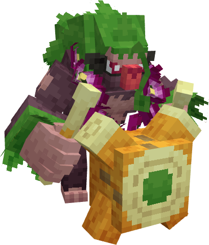<figcaption></figcaption></figure>

Kyogre d'Été

<figure>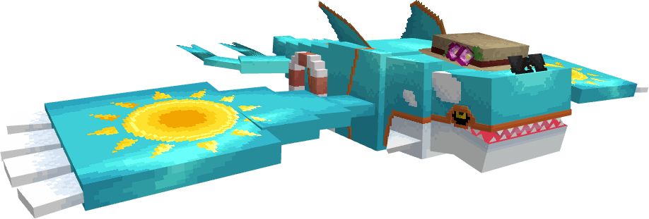<figcaption></figcaption></figure>

Lokhlass d'Été

<figure>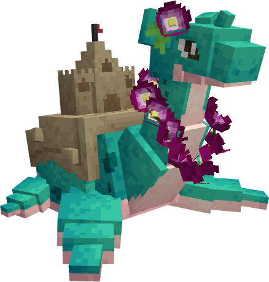<figcaption></figcaption></figure>

Lucario d'Été

<figure>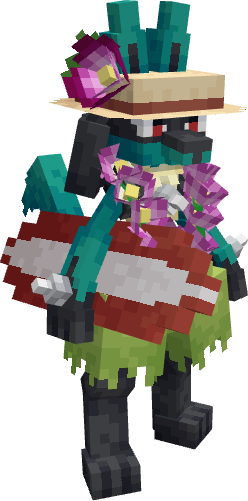<figcaption></figcaption></figure>

Ludicolo d'Été

<figure>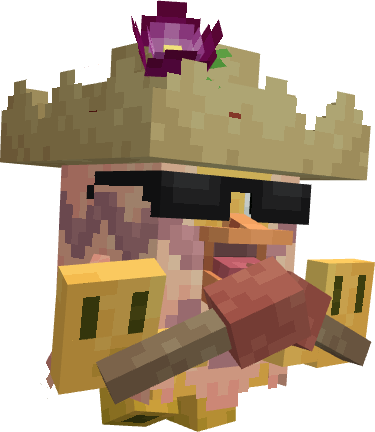<figcaption></figcaption></figure>

Meloetta d'Été

<figure>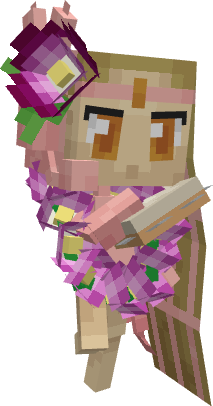<figcaption></figcaption></figure>

Mustéflott d'Été

<figure>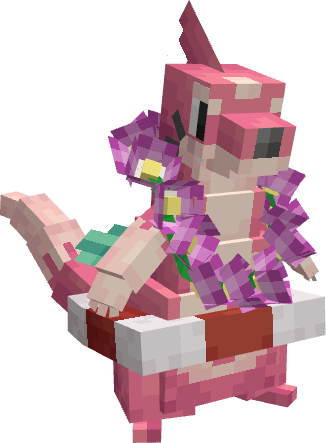<figcaption></figcaption></figure>

Nymphali d'Été

<figure>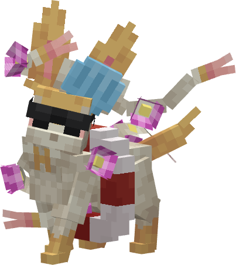<figcaption></figcaption></figure>

Oratoria d'Été

<figure>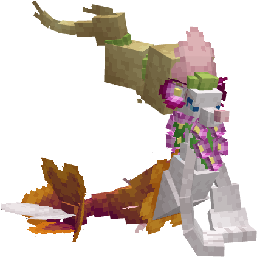<figcaption></figcaption></figure>

Oricorio d'Été

<figure>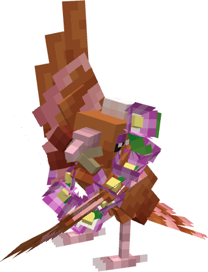<figcaption></figcaption></figure>

Pijako d'Été

<figure>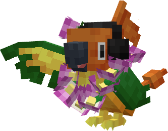<figcaption></figcaption></figure>

Pikachu d'Été

<figure>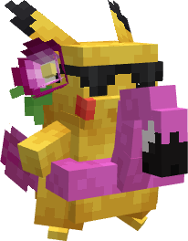<figcaption></figcaption></figure>

Pyrax d'Été

<figure>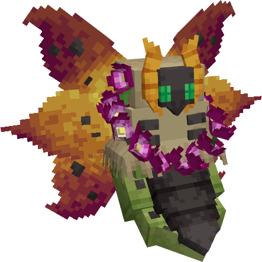<figcaption></figcaption></figure>

Salarsen d'Été

<figure>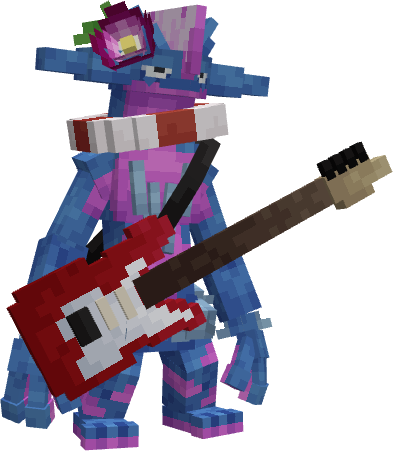<figcaption></figcaption></figure>

Tortank d'Été

<figure>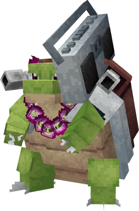<figcaption></figcaption></figure>

