# Fusion

Les **fusions** sont des Pokémon exclusifs à PokeIsland, nés de l'union de deux espèces. Chacune a son propre modèle, ses types, ses talents et des statistiques bien au-dessus de la moyenne.

***

## Comment en obtenir une

| Source | Ce que tu obtiens |
| ------ | ----------------- |
| [**Fusionneur**](../../pokeisland/fusionneur.md) | La fusion de ton choix parmi celles de la semaine, en échange de Pokémon. Elle arrive **niveau 50**, avec **5 % de chance d'être shiny**. |
| [**Œuf Fusion**](../../pokeisland/objets-speciaux.md) | Une fusion **au hasard** parmi 14. C'est la seule façon d'obtenir Amphishadow, Drattran et Galefeux. |


Les recettes du Fusionneur **tournent chaque semaine** : trois fusions sont proposées à la fois. Si celle que tu veux n'y est pas, elle reviendra dans une prochaine rotation.



Les fusions sont **interdites en Ranked et en Unranked**. Elles restent utilisables en file **Libre** (`/free`).


***

## Récapitulatif

| Fusion | Types | Total | Obtention |
| ------ | ----- | :---: | --------- |
| **Amphishadow** | Eau / Spectre | 680 | Œuf Fusion |
| **Arcolosse** | Feu / Ténèbres | 600 | Fusionneur · Œuf Fusion |
| **Arcvoir** | Psy / Normal | 700 | Fusionneur · Œuf Fusion |
| **Cizalabre** | Feu / Acier | 600 | Fusionneur · Œuf Fusion |
| **Darkzayox** | Ténèbres / Acier | 680 | Fusionneur · Œuf Fusion |
| **Dracoxys** | Psy / Dragon | 660 | Fusionneur · Œuf Fusion |
| **Drattran** | Dragon / Feu | 680 | Œuf Fusion |
| **Espevoir** | Psy / Fée | 600 | Fusionneur · Œuf Fusion |
| **Galefeux** | Feu / Acier | 600 | Œuf Fusion |
| **Gyaltaria** | Eau / Dragon | 600 | Fusionneur |
| **Lucareon** | Ténèbres / Acier | 600 | Fusionneur · Œuf Fusion |
| **Magipelin** | Feu / Spectre | 600 | Fusionneur · Œuf Fusion |
| **Mewpa** | Psy / Spectre | 760 | Fusionneur · Œuf Fusion |
| **Raygoleon** | Dragon / Eau | 720 | Fusionneur · Œuf Fusion |
| **Rexizarre** | Plante / Dragon | 600 | Fusionneur · Œuf Fusion |

***

## Les fusions

Amphishadow — Eau / Spectre

<figure>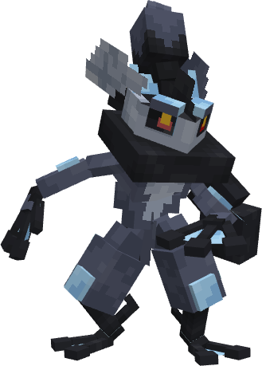<figcaption></figcaption></figure>

*Fusion de Marshadow et d'Amphinobi, Amphishadow frappe depuis les ombres avec la vitesse d'un ninja aquatique. Ses coups disparaissent avant même d'être vus.*

| Types | Talents |
| ----- | ------- |
| Eau / Spectre | Protéen, Technicien — caché : Créa-Psy |

| PV | Attaque | Défense | Atq. Spé. | Déf. Spé. | Vitesse | Total |
| :-: | :-----: | :-----: | :-------: | :-------: | :-----: | :---: |
| 90 | 115 | 85 | 140 | 115 | 135 | **680** |

**Comment l'obtenir**

* **Œuf Fusion** : au hasard parmi 14 fusions

Arcolosse — Feu / Ténèbres

<figure>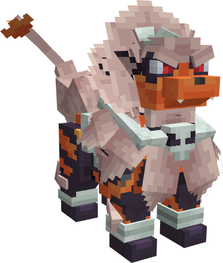<figcaption></figcaption></figure>

*Fusion d'Arcanin et de Démolosse, Arcolosse incarne la loyauté du feu et la fureur des ténèbres. Son rugissement embrase la terre et fait trembler les âmes faibles.*

| Types | Talents |
| ----- | ------- |
| Feu / Ténèbres | Intimidation, Torche — caché : Tension |

| PV | Attaque | Défense | Atq. Spé. | Déf. Spé. | Vitesse | Total |
| :-: | :-----: | :-----: | :-------: | :-------: | :-----: | :---: |
| 85 | 115 | 80 | 120 | 80 | 120 | **600** |

**Comment l'obtenir**

* **Fusionneur** : **40 × Démolosse** + **10 × Arcanin**
* **Œuf Fusion** : au hasard parmi 14 fusions

Arcvoir — Psy / Normal

<figure>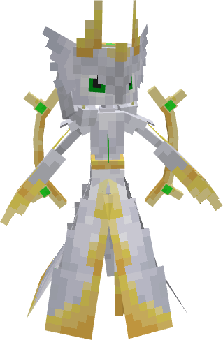<figcaption></figcaption></figure>

*Fusion d'Arceus et de Gardevoir, Arcvoir incarne la sagesse divine et la puissance psychique absolue. Sa simple présence suffit à faire plier la réalité autour de lui.*

| Types | Talents |
| ----- | ------- |
| Psy / Normal | Multi-Type, Calque — caché : Télépathe |

| PV | Attaque | Défense | Atq. Spé. | Déf. Spé. | Vitesse | Total |
| :-: | :-----: | :-----: | :-------: | :-------: | :-----: | :---: |
| 120 | 100 | 100 | 150 | 130 | 100 | **700** |

**Comment l'obtenir**

* **Fusionneur** : **30 × Gardevoir** + **3 × Arceus** *(dont un Légendaire ou Fabuleux)*
* **Œuf Fusion** : au hasard parmi 14 fusions

Cizalabre — Feu / Acier

<figure>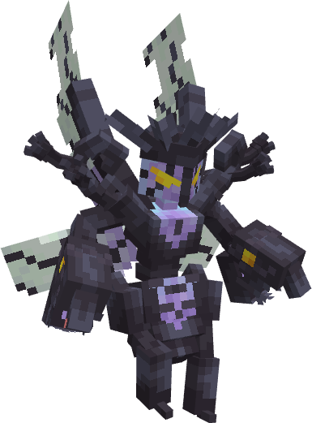<figcaption></figcaption></figure>

*Fusion de Cizayox et de Lugulabre, Cizalabre unit la précision de l'acier à la prestance royale du roi des lames. Ses coups tranchent l'air avant même que l'ennemi ne réagisse.*

| Types | Talents |
| ----- | ------- |
| Feu / Acier | Technicien, Torche — caché : Infiltration |

| PV | Attaque | Défense | Atq. Spé. | Déf. Spé. | Vitesse | Total |
| :-: | :-----: | :-----: | :-------: | :-------: | :-----: | :---: |
| 70 | 115 | 95 | 120 | 85 | 115 | **600** |

**Comment l'obtenir**

* **Fusionneur** : **30 × Cizayox** + **15 × Lugulabre**
* **Œuf Fusion** : au hasard parmi 14 fusions

Darkzayox — Ténèbres / Acier

<figure>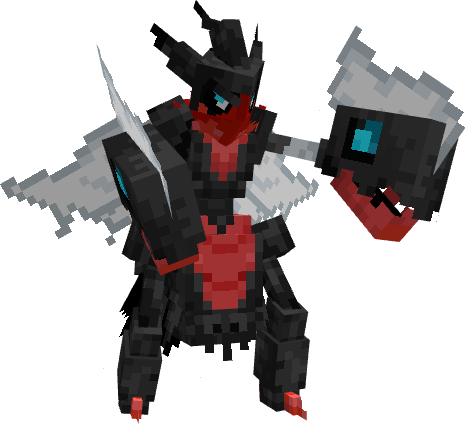<figcaption></figcaption></figure>

*Fusion de Darkrai et de Cizayox, Darkzayox lacère l'ombre elle-même de ses lames d'acier. Il frappe à la vitesse d'un rêve, puis disparaît dans un éclat de ténèbres.*

| Types | Talents |
| ----- | ------- |
| Ténèbres / Acier | Technicien, Insomnia — caché : Mauvais Rêve |

| PV | Attaque | Défense | Atq. Spé. | Déf. Spé. | Vitesse | Total |
| :-: | :-----: | :-----: | :-------: | :-------: | :-----: | :---: |
| 85 | 140 | 100 | 115 | 100 | 140 | **680** |

**Comment l'obtenir**

* **Fusionneur** : **30 × Cizayox** + **3 × Darkrai** *(dont un Légendaire ou Fabuleux)*
* **Œuf Fusion** : au hasard parmi 14 fusions

Dracoxys — Psy / Dragon

<figure>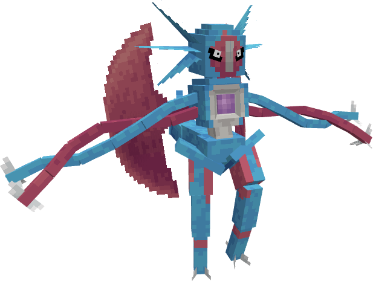<figcaption></figcaption></figure>

*Fusion de Drattak et de Deoxys, Dracoxys combine la puissance dragonique et l'esprit cosmique. Ses ailes lui permettent de traverser l'espace en un éclair.*

| Types | Talents |
| ----- | ------- |
| Psy / Dragon | Pression — caché : Impudence |

| PV | Attaque | Défense | Atq. Spé. | Déf. Spé. | Vitesse | Total |
| :-: | :-----: | :-----: | :-------: | :-------: | :-----: | :---: |
| 83 | 155 | 70 | 142 | 70 | 140 | **660** |

**Comment l'obtenir**

* **Fusionneur** : **40 × Drattak** + **3 × Deoxys** *(dont un Légendaire ou Fabuleux)*
* **Œuf Fusion** : au hasard parmi 14 fusions

Drattran — Dragon / Feu

<figure>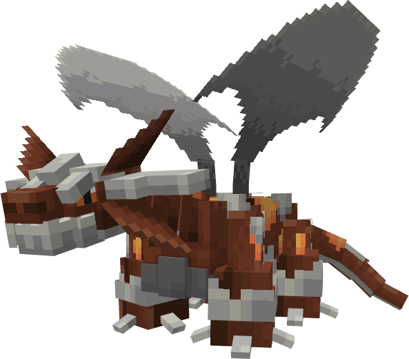<figcaption></figcaption></figure>

*Fusion de Drattak et de Heatran, Drattran possède un corps à la chaleur incandescente capable de faire fondre la roche. Il domine les cieux et laisse derrière lui des traînées brûlantes.*

| Types | Talents |
| ----- | ------- |
| Dragon / Feu | Intimidation, Torche — caché : Impudence |

| PV | Attaque | Défense | Atq. Spé. | Déf. Spé. | Vitesse | Total |
| :-: | :-----: | :-----: | :-------: | :-------: | :-----: | :---: |
| 100 | 140 | 100 | 130 | 95 | 115 | **680** |

**Comment l'obtenir**

* **Œuf Fusion** : au hasard parmi 14 fusions

Espevoir — Psy / Fée

<figure>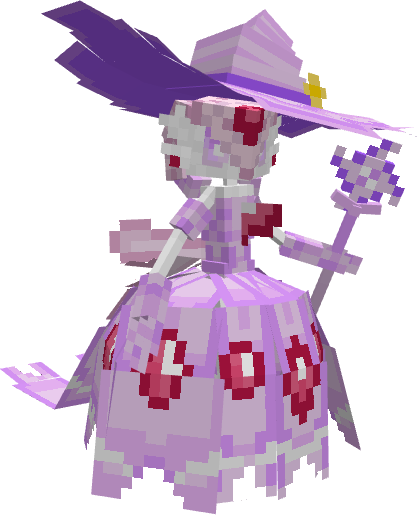<figcaption></figcaption></figure>

*Fusion d'Évoli et de Gardevoir, Espevoir canalise une énergie psychique pure, capable d'apaiser ou de briser les esprits. Sa grâce cache une puissance dévastatrice.*

| Types | Talents |
| ----- | ------- |
| Psy / Fée | Synchro, Calque — caché : Miroir Magik |

| PV | Attaque | Défense | Atq. Spé. | Déf. Spé. | Vitesse | Total |
| :-: | :-----: | :-----: | :-------: | :-------: | :-----: | :---: |
| 80 | 65 | 75 | 135 | 120 | 125 | **600** |

**Comment l'obtenir**

* **Fusionneur** : **40 × Gardevoir** + **10 × Mentali**
* **Œuf Fusion** : au hasard parmi 14 fusions

Galefeux — Feu / Acier

<figure>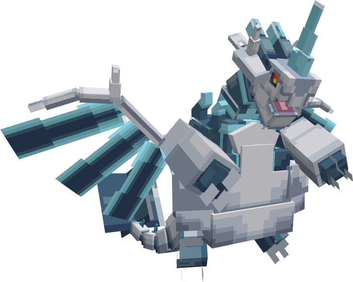<figcaption></figcaption></figure>

*Fusion de Galeking et de Dracaufeu, Galefeux allie la robustesse de l'acier à la majesté du feu draconique. Son corps incandescent réduit en cendres tout obstacle sur son passage.*

| Types | Talents |
| ----- | ------- |
| Feu / Acier | Corps Ardent, Tête de Roc — caché : Fermeté |

| PV | Attaque | Défense | Atq. Spé. | Déf. Spé. | Vitesse | Total |
| :-: | :-----: | :-----: | :-------: | :-------: | :-----: | :---: |
| 85 | 130 | 115 | 100 | 85 | 85 | **600** |

**Comment l'obtenir**

* **Œuf Fusion** : au hasard parmi 14 fusions

Gyaltaria — Eau / Dragon

<figure>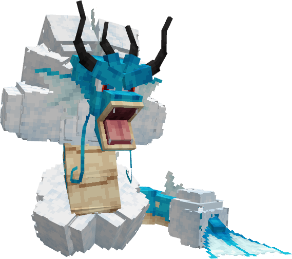<figcaption></figcaption></figure>

*Fusion de Léviator et d'Altaria, Gyaltaria tempère la rage du serpent par la sérénité du dragon des nuages. Il chevauche les tempêtes entre l'océan et le ciel.*

| Types | Talents |
| ----- | ------- |
| Eau / Dragon | Intimidation, Médic Nature — caché : Impudence |

| PV | Attaque | Défense | Atq. Spé. | Déf. Spé. | Vitesse | Total |
| :-: | :-----: | :-----: | :-------: | :-------: | :-----: | :---: |
| 100 | 120 | 95 | 90 | 110 | 85 | **600** |

**Comment l'obtenir**

* **Fusionneur** : **30 × Léviator** + **15 × Altaria**

Lucareon — Ténèbres / Acier

<figure>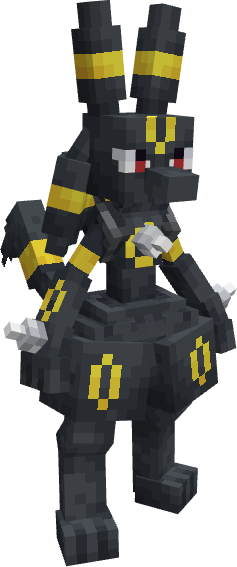<figcaption></figcaption></figure>

*Fusion de Lucario et de Noctali, Lucareon perçoit les émotions même dans l'obscurité la plus profonde. Son aura brillante aux teintes de la lune en fait un protecteur loyal de la nuit.*

| Types | Talents |
| ----- | ------- |
| Ténèbres / Acier | Impassible, Synchro — caché : Attention |

| PV | Attaque | Défense | Atq. Spé. | Déf. Spé. | Vitesse | Total |
| :-: | :-----: | :-----: | :-------: | :-------: | :-----: | :---: |
| 90 | 105 | 100 | 105 | 115 | 85 | **600** |

**Comment l'obtenir**

* **Fusionneur** : **30 × Lucario** + **10 × Noctali**
* **Œuf Fusion** : au hasard parmi 14 fusions

Magipelin — Feu / Spectre

<figure>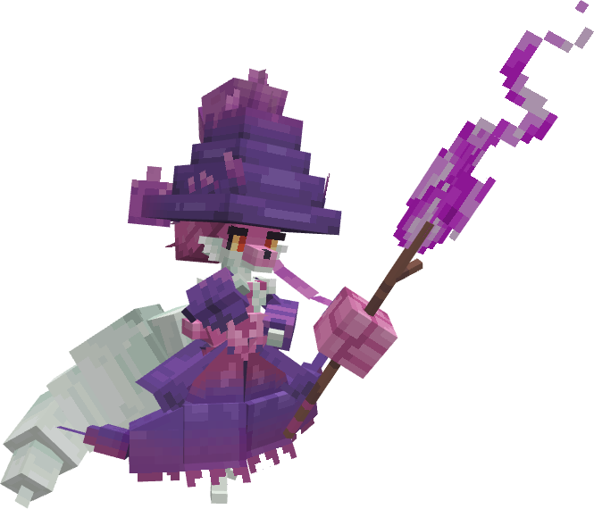<figcaption></figcaption></figure>

*Fusion de Goupelin et de Magirêve, Magipelin manie une magie envoûtante mêlant feu et illusions spectrales. Son aura mystique perturbe les sens de ceux qui croisent son regard.*

| Types | Talents |
| ----- | ------- |
| Feu / Spectre | Torche, Garde Magik — caché : Infiltration |

| PV | Attaque | Défense | Atq. Spé. | Déf. Spé. | Vitesse | Total |
| :-: | :-----: | :-----: | :-------: | :-------: | :-----: | :---: |
| 80 | 55 | 75 | 140 | 115 | 135 | **600** |

**Comment l'obtenir**

* **Fusionneur** : **30 × Goupelin** + **10 × Magirêve**
* **Œuf Fusion** : au hasard parmi 14 fusions

Mewpa — Psy / Spectre

<figure>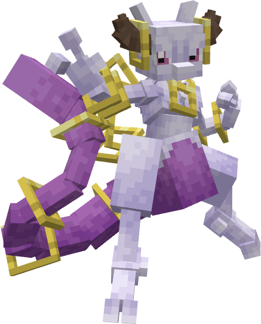<figcaption></figcaption></figure>

*Fusion de Mewtwo et d'Hoopa, Mewpa déploie sa puissance psychique à travers des anneaux interdimensionnels. Ses frappes d'hyperespace défient toute logique.*

| Types | Talents |
| ----- | ------- |
| Psy / Spectre | Pression, Magicien — caché : Tension |

| PV | Attaque | Défense | Atq. Spé. | Déf. Spé. | Vitesse | Total |
| :-: | :-----: | :-----: | :-------: | :-------: | :-----: | :---: |
| 110 | 130 | 100 | 170 | 130 | 120 | **760** |

**Comment l'obtenir**

* **Fusionneur** : **3 × Mewtwo** + **3 × Hoopa** *(deux ingrédients Légendaires ou Fabuleux)*
* **Œuf Fusion** : au hasard parmi 14 fusions

Raygoleon — Dragon / Eau

<figure>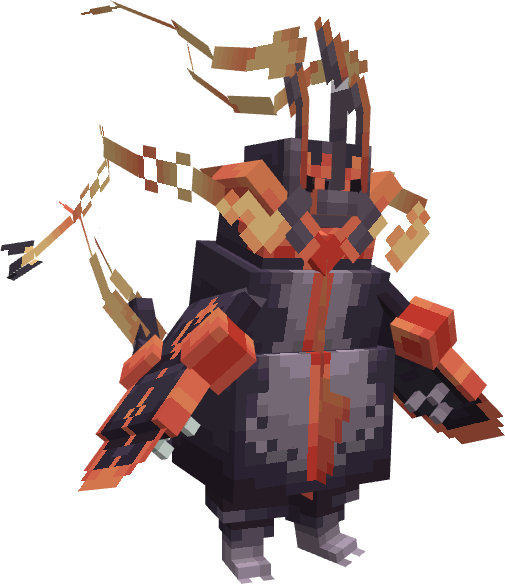<figcaption></figcaption></figure>

*Fusion de Rayquaza et de Pingoléon, Raygoleon domine ciel et océan d'un même souffle draconique. Les tempêtes s'abaissent sur son passage pour obéir à sa volonté.*

| Types | Talents |
| ----- | ------- |
| Dragon / Eau | Air Lock, Torrent — caché : Battant |

| PV | Attaque | Défense | Atq. Spé. | Déf. Spé. | Vitesse | Total |
| :-: | :-----: | :-----: | :-------: | :-------: | :-----: | :---: |
| 100 | 140 | 95 | 140 | 100 | 145 | **720** |

**Comment l'obtenir**

* **Fusionneur** : **3 × Rayquaza** + **3 × Pingoléon** *(dont un Légendaire ou Fabuleux)*
* **Œuf Fusion** : au hasard parmi 14 fusions

Rexizarre — Plante / Dragon

<figure>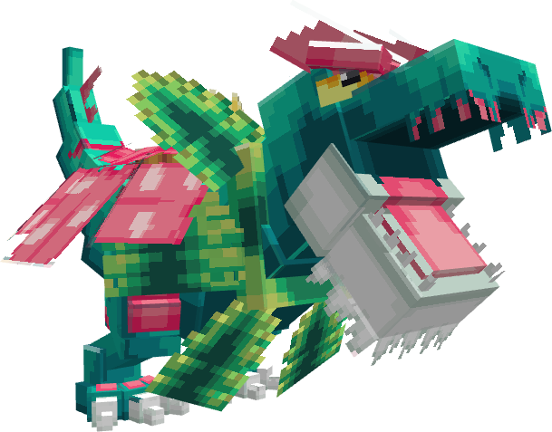<figcaption></figcaption></figure>

*Fusion de Rexillius et de Florizarre, Rexizarre marie la mâchoire préhistorique à la puissance de la jungle. Son rugissement fait trembler la terre et faner la végétation alentour.*

| Types | Talents |
| ----- | ------- |
| Plante / Dragon | Prognathe, Engrais — caché : Tête de Roc |

| PV | Attaque | Défense | Atq. Spé. | Déf. Spé. | Vitesse | Total |
| :-: | :-----: | :-----: | :-------: | :-------: | :-----: | :---: |
| 90 | 125 | 105 | 85 | 80 | 115 | **600** |

**Comment l'obtenir**

* **Fusionneur** : **30 × Florizarre** + **20 × Rexillius**
* **Œuf Fusion** : au hasard parmi 14 fusions

