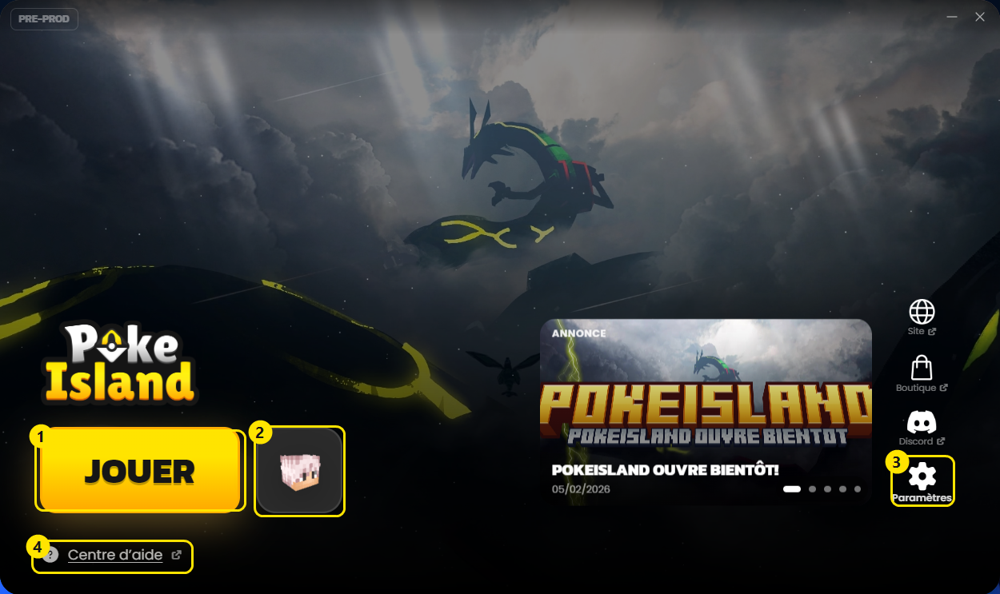
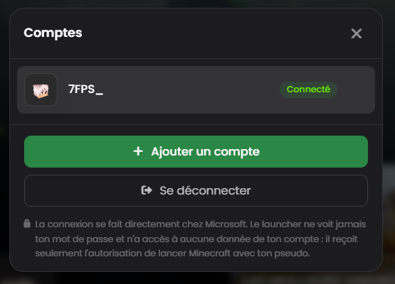

# Problèmes de launcher

<mark style="color:$info;">Trouve le message que tu vois à l'écran, la solution se déplie dessous.<mark style="color:$info;">

<table data-view="cards"><thead><tr><th></th><th data-hidden data-card-cover data-type="image">Cover image</th><th data-hidden data-card-target data-type="content-ref"></th></tr></thead><tbody><tr><td><strong>Windows a protégé votre ordinateur</strong></td><td><a href="../.gitbook/assets/launcher-carte-installation-windows.png">launcher-carte-installation-windows.png</a></td><td><a href="launcher.md#windows-a-protege-votre-ordinateur">#windows-a-protege-votre-ordinateur</a></td></tr><tr><td><strong>Problème de connexion / Compte Microsoft</strong></td><td><a href="../.gitbook/assets/launcher-carte-connexion-microsoft.png">launcher-carte-connexion-microsoft.png</a></td><td><a href="launcher.md#probleme-de-connexion-compte-microsoft">#probleme-de-connexion-compte-microsoft</a></td></tr><tr><td><strong>Compte sans Minecraft Java Edition</strong></td><td><a href="../.gitbook/assets/launcher-carte-compte-sans-java.png">launcher-carte-compte-sans-java.png</a></td><td><a href="launcher.md#compte-sans-minecraft-java-edition">#compte-sans-minecraft-java-edition</a></td></tr><tr><td><strong>Session Microsoft expirée</strong></td><td><a href="../.gitbook/assets/launcher-carte-session-expiree.png">launcher-carte-session-expiree.png</a></td><td><a href="launcher.md#session-microsoft-expiree">#session-microsoft-expiree</a></td></tr><tr><td><strong>Échec de la connexion Microsoft</strong></td><td><a href="../.gitbook/assets/launcher-carte-echec-connexion.png">launcher-carte-echec-connexion.png</a></td><td><a href="launcher.md#echec-de-la-connexion-microsoft">#echec-de-la-connexion-microsoft</a></td></tr><tr><td><strong>Connexion impossible aux serveurs Microsoft</strong></td><td><a href="../.gitbook/assets/launcher-carte-serveurs-microsoft.png">launcher-carte-serveurs-microsoft.png</a></td><td><a href="launcher.md#connexion-impossible-aux-serveurs-microsoft">#connexion-impossible-aux-serveurs-microsoft</a></td></tr><tr><td><strong>Erreur: Error: connect ETIMEDOUT ******</strong></td><td><a href="../.gitbook/assets/launcher-carte-timeout-reseau.png">launcher-carte-timeout-reseau.png</a></td><td><a href="launcher.md#erreur-error-connect-etimedout">#erreur-error-connect-etimedout</a></td></tr><tr><td><strong>Problème de configuration du launcher</strong></td><td><a href="../.gitbook/assets/launcher-carte-configuration.png">launcher-carte-configuration.png</a></td><td><a href="launcher.md#probleme-de-configuration-du-launcher">#probleme-de-configuration-du-launcher</a></td></tr><tr><td><strong>Blocage sur "Lancement..." à 100%</strong></td><td><a href="../.gitbook/assets/launcher-carte-blocage-lancement.png">launcher-carte-blocage-lancement.png</a></td><td><a href="launcher.md#blocage-sur-lancement...-a-100">#blocage-sur-lancement...-a-100</a></td></tr><tr><td><strong>Erreur "Incompatible mods found!"</strong></td><td><a href="../.gitbook/assets/launcher-carte-mods-incompatibles.png">launcher-carte-mods-incompatibles.png</a></td><td><a href="launcher.md#erreur-incompatible-mods-found">#erreur-incompatible-mods-found</a></td></tr><tr><td><strong>Toujours bloqué, malgré les solutions ?</strong></td><td><a href="../.gitbook/assets/launcher-carte-assistance.png">launcher-carte-assistance.png</a></td><td><a href="launcher.md#toujours-bloque-malgre-les-solutions">#toujours-bloque-malgre-les-solutions</a></td></tr></tbody></table>

***

## Repérer les éléments du launcher

<mark style="color:$info;">Les solutions ci-dessous font référence à ces quatre endroits.<mark style="color:$info;">

<figure><figcaption></figcaption></figure>

<table><thead><tr><th width="80">Repère</th><th width="180">Élément</th><th>À quoi ça sert</th></tr></thead><tbody><tr><td><strong>1</strong></td><td>Bouton JOUER</td><td>Télécharge les fichiers manquants puis lance le jeu.</td></tr><tr><td><strong>2</strong></td><td>Ta tête de personnage</td><td>Ouvre la fenêtre des comptes : changer de compte, en ajouter un, se déconnecter.</td></tr><tr><td><strong>3</strong></td><td>Paramètres</td><td>Mémoire allouée, plein écran, dossier du launcher, réparation des fichiers.</td></tr><tr><td><strong>4</strong></td><td>Centre d'aide</td><td>Te ramène sur ces pages.</td></tr></tbody></table>

***

## Les solutions

<strong>Windows a protégé votre ordinateur</strong>

Si un avertissement apparaît au téléchargement ou à l'ouverture du fichier d'installation


Cet avertissement ne signale **aucun virus**. Windows le montre pour tout programme qu'il ne connaît pas encore, et le launcher PokeIsland est trop récent et trop peu téléchargé pour figurer dans sa liste.


**Étape 1 : Conserver le téléchargement**

<figure><figcaption>
Dans votre navigateur, cliquez sur les trois petits points : <strong>Conserver</strong>
</figcaption></figure>

<figure><figcaption>
Encore sur les trois petits points : <strong>Conserver quand même</strong>
</figcaption></figure>

<figure><figcaption>
Puis ouvrez le fichier téléchargé
</figcaption></figure>

**Étape 2 : Autoriser l'exécution**

<figure><figcaption>
Windows a protégé votre ordinateur : cliquez sur le lien <strong>Informations complémentaires</strong>
</figcaption></figure>

<figure><figcaption>
Cliquez sur le bouton : <strong>Exécuter quand même</strong>
</figcaption></figure>

Télécharge toujours le launcher depuis <a href="https://pokeisland.fr/jouer/">pokeisland.fr/jouer</a>. Un fichier récupéré ailleurs n'est pas le nôtre.

<strong>Problème de connexion / Compte Microsoft</strong>

Si vous n'arrivez pas à passer le gros bouton jaune "CONNEXION"

**Solution 1 : La fenêtre Microsoft ne s'ouvre pas**

> * La connexion se fait dans une fenêtre qui s'ouvre par-dessus le launcher. Elle peut apparaître **derrière** la fenêtre principale : vérifiez votre barre des tâches.
> * Si elle ne s'ouvre pas du tout, votre **antivirus** la bloque probablement. Ajoutez le launcher en exception, puis réessayez.

**Solution 2 : Vérifications du compte**

> * **Le bon compte :** Vérifiez que vous utilisez le bon compte Microsoft lié à votre compte Minecraft.
> * **Le bon jeu :** Vous devez obligatoirement posséder **Minecraft Java Edition**.
> * **Le pseudo :** Si vous venez d'acheter le jeu, lancez-le d'abord une fois via le **launcher officiel Minecraft** pour créer votre pseudo en jeu.

Le launcher PokeIsland ne peut pas vous connecter si vous n'avez pas de pseudo défini ou si vous ne possédez pas le jeu.

<strong>Compte sans Minecraft Java Edition</strong>

Si le launcher affiche "Ce compte Microsoft ne possède pas Minecraft : Java Edition"

**Le compte utilisé n'a pas le jeu**

> * Vérifiez que vous vous connectez avec le compte Microsoft qui a **acheté** Minecraft.
> * Beaucoup de joueurs ont plusieurs comptes Microsoft (un compte personnel, un compte scolaire, un compte familial) : seul celui qui possède le jeu fonctionne.
> * Dans la fenêtre de connexion Microsoft, cliquez sur **Utiliser un autre compte** si le mauvais compte est proposé automatiquement.

**Vous avez Minecraft mais pas sur la bonne édition**

> * PokeIsland fonctionne uniquement sur **Minecraft Java Edition** (Ordinateur).
> * **Bedrock Edition** (Console, Windows Store, Tablette, Téléphone) n'est pas compatible et ne le sera pas.
> * Les deux éditions sont deux jeux différents : posséder Bedrock ne donne pas accès à Java.

**Vous venez d'acheter le jeu**

> * Lancez d'abord le **launcher officiel Minecraft** une première fois pour créer votre pseudo.
> * Tant qu'aucun pseudo n'est défini, aucun launcher ne peut vous connecter.

Vérifiez ce que possède votre compte sur <a href="https://www.minecraft.net/msaprofile/mygames">minecraft.net/msaprofile/mygames</a>

<strong>Session Microsoft expirée</strong>

Si le message "Session Microsoft expirée" s'affiche en bas de votre launcher

> * Cliquez sur **votre tête de personnage**, à droite du bouton JOUER, pour ouvrir la fenêtre des comptes.
> * Cliquez sur **Se déconnecter**, puis reconnectez-vous.

<figure><figcaption>
La fenêtre des comptes, ouverte depuis votre tête de personnage
</figcaption></figure>

Une simple reconnexion règle généralement ce souci de session. 

<strong>Échec de la connexion Microsoft</strong>

Si le launcher affiche "La connexion Microsoft a échoué" sans plus de précision

> * Fermez complètement le launcher, puis relancez-le et réessayez : la majorité de ces échecs sont temporaires.
> * Si la fenêtre Microsoft s'ouvre puis se ferme immédiatement, votre **antivirus** bloque probablement la fenêtre. Mettez le launcher en exception.
> * Si le message revient à chaque tentative, ouvrez un ticket en précisant l'heure exacte de votre dernier essai : l'équipe pourra retrouver l'erreur technique dans les journaux.

<strong>Connexion impossible aux serveurs Microsoft</strong>

Si le launcher affiche "Impossible de joindre les serveurs Microsoft"

> * Vérifiez que votre connexion internet fonctionne en ouvrant un site quelconque dans votre navigateur.
> * Si vous êtes sur le **Wi-Fi d'une école, d'une entreprise ou d'un hôtel**, l'accès à Microsoft est souvent bloqué : essayez sur une autre connexion, par exemple le partage de connexion de votre téléphone.
> * Désactivez temporairement votre **VPN** ou votre **antivirus**, qui peuvent bloquer la fenêtre de connexion.
> * Si le problème persiste, les serveurs Microsoft sont peut-être en panne : vérifiez sur <a href="https://downdetector.fr/statut/minecraft/">downdetector</a> et réessayez plus tard.

<strong>Erreur: Error: connect ETIMEDOUT ******</strong>

Si le message "**Error: connect ETIMEDOUT \*\*\*\*\*\***" s'affiche en bas de votre launcher

> * Ouvrez **Panneau de configuration**
>   * Si vous ne savez pas, faites :
>   * (<kbd>Windows</kbd> + <kbd>R</kbd>, tapez <kbd>control</kbd>, puis <kbd>Entrée</kbd>)
> * Cliquez sur **Réseau et Internet**
> * Cliquez sur **Centre Réseau et partage**
> * Sur la gauche, cliquez sur **Modifier les paramètres de la carte**
> * Cherchez la connexion que vous utilisez (Wi-Fi ou Ethernet)
> * Faites clic droit → **Propriétés**
> * Dans la liste, décochez **Protocole Internet version 6 (TCP/IPv6)**
> * Cliquez sur **OK**
> * Redémarrez votre launcher

<strong>Problème de configuration du launcher</strong>

Si le launcher affiche "La connexion est indisponible à cause d'un problème de configuration de notre côté"

> * Ce message ne vient pas de votre ordinateur : il signale une erreur de configuration côté PokeIsland.
> * Il n'y a **rien à faire de votre côté**, aucune manipulation ne le règlera.
> * Signalez-le dans un ticket pour que l'équipe corrige le problème au plus vite.

<strong>Blocage sur "Lancement..." à 100%</strong>

Si votre launcher reste figé indéfiniment sur la barre de chargement à 100%

**Étape 1 : Patienter et vérifier**

> * Laissez le launcher tourner : si votre PC ou votre connexion est lent, l'installation finale peut prendre plusieurs minutes.
> * Vérifiez qu'il vous reste assez d'**espace de stockage** sur votre disque dur.

**Étape 2 : La réinstallation propre**

> * Si rien ne bouge après une longue attente, fermez le launcher.
> * Appuyez sur les touches <kbd>**Windows**</kbd>**&#x20;+&#x20;**<kbd>**R**</kbd> de votre clavier.
> * Tapez <kbd>**%appdata%**</kbd> et validez avec Entrée.
> * Trouvez le dossier <kbd>**.pokeisland**</kbd> et supprimez-le.
> * Videz votre corbeille, puis réinstaller le launcher depuis le site.

Cette manipulation supprime les fichiers corrompus et règle la majorité des blocages.

<strong>Erreur "Incompatible mods found!"</strong>

Si une fenêtre blanche d'erreur Fabric s'affiche au lancement

> * Ce problème arrive quand un fichier du jeu a mal été téléchargé.
> * Cliquez simplement sur le bouton **Exit** en bas à droite pour fermer l'erreur.
> * Relancez le jeu depuis le launcher.

Le launcher va automatiquement détecter le fichier manquant ou cassé et le re-télécharger correctement.

<strong>Toujours bloqué, malgré les solutions ?</strong>

Si aucune des solutions de ce fil n'a réussi à régler votre problème :

> * Rendez-vous dans le salon <kbd>**#support**</kbd> du Discord.
> * Cliquez sur le bouton **Ouvrir un ticket** et sélectionnez la catégorie **Problème Launcher**.
> * Précisez que vous avez déjà essayé les solutions de cette page, et lesquelles.
> * Joignez une **capture d'écran complète** ainsi que le fichier `launcher.log`.

La marche à suivre détaillée se trouve sur la page <a href="ticket.md">Ouvrir un ticket</a>

***

<table data-view="cards"><thead><tr><th></th><th></th><th data-hidden data-card-target data-type="content-ref"></th></tr></thead><tbody><tr><td><strong>Ouvrir un ticket</strong></td><td>Quand rien de cette page n'a fonctionné</td><td><a href="ticket.md">ticket.md</a></td></tr><tr><td><strong>Centre d'aide</strong></td><td>Revenir à l'ensemble de l'aide joueur</td><td><a href="./">Centre d'aide</a></td></tr></tbody></table>
