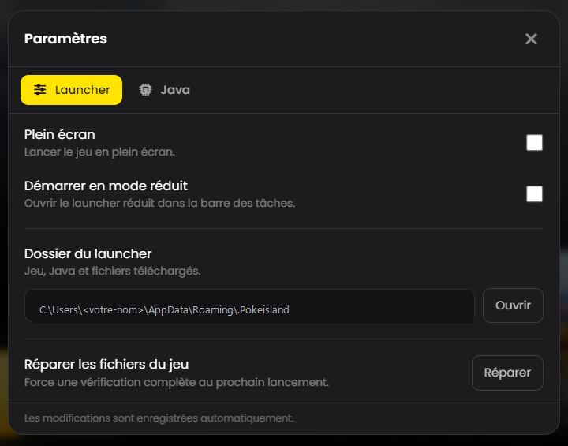

# Ouvrir un ticket

## Avant d'ouvrir un ticket

<mark style="color:$info;">Un ticket demande à un membre de l'équipe de se rendre disponible. Deux minutes de vérification t'évitent souvent une heure d'attente.<mark style="color:$info;">


La très grande majorité des tickets « le launcher ne marche pas » se règlent avec la page [Problèmes de launcher](launcher.md). Parcours-la d'abord : la réponse y est presque toujours, et tu joues tout de suite.


***

## Les étapes



### Rejoins le Discord

Si tu n'y es pas encore : [discord.gg/Ut4peR5wpt](https://discord.gg/Ut4peR5wpt)



### Va dans le salon #support

Il se trouve dans la liste des salons, à gauche de l'écran Discord.



### Clique sur le bouton « Ouvrir un ticket »

Le bouton est épinglé en haut du salon. Ce n'est pas la peine d'écrire ton problème dans le salon lui-même : personne n'y répond, tout se passe dans le ticket.



### Choisis la catégorie qui correspond

Le choix de la catégorie détermine quel membre de l'équipe reçoit ta demande. Une mauvaise catégorie rallonge le délai de réponse.



### Décris ton problème

Un salon privé s'ouvre, visible uniquement par toi et l'équipe. C'est là que tu expliques ta situation.



***

## Ce qu'il faut mettre dans ton message

<mark style="color:$info;">Plus ton premier message est complet, moins il y aura d'allers-retours.<mark style="color:$info;">

<table><thead><tr><th width="230">À donner</th><th>Pourquoi</th></tr></thead><tbody><tr><td><strong>Ton pseudo Minecraft</strong></td><td>Sans lui, l'équipe ne peut rien vérifier sur ton compte.</td></tr><tr><td><strong>Le message d'erreur exact</strong></td><td>Recopie-le ou fais une capture. « Ça marche pas » ne permet aucun diagnostic.</td></tr><tr><td><strong>Une capture d'écran complète</strong></td><td>Toute la fenêtre, pas seulement l'erreur : le contexte autour est souvent ce qui trahit la cause.</td></tr><tr><td><strong>Ce que tu as déjà essayé</strong></td><td>Évite qu'on te fasse refaire des manipulations inutiles.</td></tr><tr><td><strong>Quand ça a commencé</strong></td><td>Permet de recouper avec une mise à jour ou une panne connue.</td></tr></tbody></table>


**Comment faire une capture d'écran ?** Appuie sur <kbd>Windows</kbd> + <kbd>Maj</kbd> + <kbd>S</kbd>, sélectionne la zone, puis colle l'image directement dans Discord avec <kbd>Ctrl</kbd> + <kbd>V</kbd>.


***

## Le journal du launcher

<mark style="color:$info;">Si l'équipe te le demande, voici où le trouver.<mark style="color:$info;">

Le launcher enregistre tout ce qu'il fait dans un fichier. Il contient souvent la cause exacte d'un problème que rien ne laisse deviner à l'écran.

> * Appuie sur <kbd>Windows</kbd> + <kbd>R</kbd>
> * Tape <kbd>%appdata%\\.Pokeisland\logs</kbd> puis valide
> * Envoie le fichier <kbd>launcher.log</kbd> dans ton ticket

Tu peux aussi passer par le launcher : **Paramètres**, puis **Ouvrir** à côté du dossier du launcher, et va dans le dossier `logs`.

<figure><figcaption>
Le bouton <strong>Ouvrir</strong> t'amène directement au bon dossier
</figcaption></figure>


Ce fichier ne contient **aucun mot de passe**. Il n'enregistre que le déroulé technique du launcher : téléchargements, lancements et erreurs.

