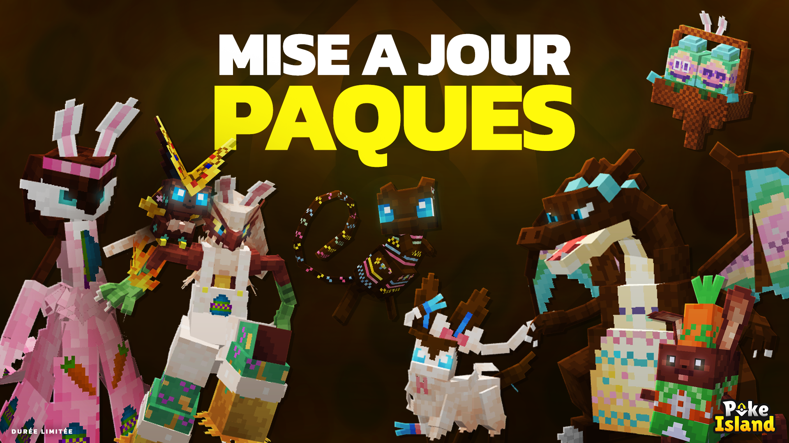

# Mise à jour de Pâques

<figure><figcaption></figcaption></figure>

Azumarill de Pâques

<figure><figcaption></figcaption></figure>

Brasegali de Pâques

<figure><figcaption></figcaption></figure>

Charmilly de Pâques

<figure><figcaption></figcaption></figure>

Dracaufeu de Pâques

<figure><figcaption></figcaption></figure>

Dracolosse de Pâques

<figure><figcaption></figcaption></figure>

Farfaduvet de Pâques

<figure><figcaption></figcaption></figure>

Flambusard de Pâques

<figure><figcaption></figcaption></figure>

Florges de Pâques

<figure><figcaption></figcaption></figure>

Fragilady de Pâques

<figure><figcaption></figcaption></figure>

Gardevoir de Pâques

<figure><figcaption></figcaption></figure>

Guérilande de Pâques

<figure><figcaption></figcaption></figure>

Leuphorie de Pâques

<figure><figcaption></figcaption></figure>

Lockpin de Pâques

<figure><figcaption></figcaption></figure>

Mew de Pâques

<figure><figcaption></figcaption></figure>

Nymphali de Pâques

<figure><figcaption></figcaption></figure>

Shaymin de Pâques

<figure><figcaption></figcaption></figure>

Sorbouboul de Pâques

<figure><figcaption></figcaption></figure>

Sucreine de Pâques

<figure><figcaption></figcaption></figure>

Togekiss de Pâques

<figure><figcaption></figcaption></figure>

Victini de Pâques

<figure><figcaption></figcaption></figure>

