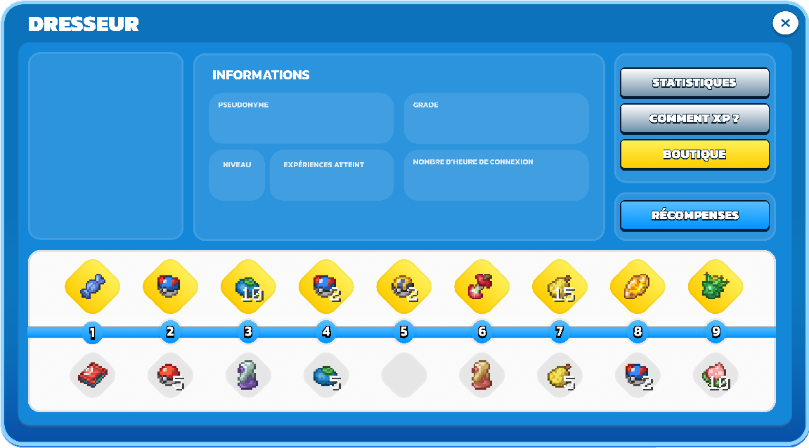

# Dresseur

Après avoir choisi ton starter pour débuter : tu démarres ton aventure au **niveau 1** et tu obtiens une **récompense de bienvenue** (Pokédex). Le système comporte un total de 100 niveaux de dresseur, chacun offrant des avantages.

<figure><figcaption>
<kbd><strong>/dresseur</strong></kbd> Ouvre l'interface de dresseur 
</figcaption></figure>

Pour augmenter ton niveau de dresseur tu peux effectuer plusieurs actions, pour connaître ce qui peut te faire monter de niveau tu peux cliquer sur le bouton **Comment XP ?**

* Capturer un Pokémon <mark style="background-color:yellow;">**35 - 175 EXP**</mark>
* Vaincre un Pokémon <mark style="background-color:yellow;">**20 - 140 EXP**</mark>
* Découvrir une Île du PokéWorld <mark style="background-color:yellow;">**1000 EXP**</mark>
* Battre un Champion d'Arène <mark style="background-color:yellow;">**150 - 3000 EXP**</mark>
* Battre un dresseur dans la nature <mark style="background-color:yellow;">**50 - 200 EXP**</mark>
* Vendre à l'œuf de Marchand <mark style="background-color:yellow;">**5 EXP / PokeCoins**</mark>
* Réaliser des quêtes <mark style="background-color:yellow;">**75 - 6000 EXP**</mark>
* Récupérer son Reward <mark style="background-color:yellow;">**10 - 1200 EXP**</mark>
* Augmenter son % de progression du Pokédex <mark style="background-color:yellow;">**500 - 5000 EXP / 25%**</mark>

🎁 Récompenses par niveau

À chaque niveau franchi, tu reçois automatiquement des récompenses. Elles sont divisées en deux colonnes : **gratuit** (tout le monde) et **premium** (joueurs avec l'abonnement Premium).


Les niveaux marqués d'une 🔓 débloquent du contenu exclusif en plus de leurs récompenses habituelles.


<table><thead><tr><th width="98">Niveau</th><th width="150">Déblocage</th><th>Récompense gratuite</th><th>Récompense premium</th></tr></thead><tbody><tr><td><strong>1</strong> 🔓</td><td>Pokédex offert</td><td>Pokédex + 200 coins</td><td>8× Bonbon Rare</td></tr><tr><td><strong>2</strong></td><td>—</td><td>10 tokens + 16× Poké Ball</td><td>8× Super Ball</td></tr><tr><td><strong>3</strong></td><td>—</td><td>10 tokens + 1× Potion</td><td>4× Baie Oran</td></tr><tr><td><strong>4</strong></td><td>—</td><td>11 tokens + 1× PokéNav</td><td>3× Bonbon Rare</td></tr><tr><td><strong>5</strong> 🔓</td><td><strong>Arène Cachée du Spawn</strong></td><td>11 tokens + 1 000 coins</td><td>Clé Dresseur ×1</td></tr><tr><td><strong>6</strong></td><td>—</td><td>11 tokens + 1× Canne à Pêche</td><td>Small Energy Pack</td></tr><tr><td><strong>7</strong></td><td>—</td><td>11 tokens + 1× Super Potion</td><td>2× Luxury Ball</td></tr><tr><td><strong>8</strong></td><td>—</td><td>11 tokens + 8× Super Ball</td><td>Safari Ticket ×1</td></tr><tr><td><strong>9</strong></td><td>—</td><td>12 tokens + 1× Rappel</td><td>1× Pierre Feu</td></tr><tr><td><strong>10</strong> 🔓</td><td><strong>Arène Eau</strong></td><td>12 tokens + 2 000 coins</td><td>Parchemin Commun</td></tr><tr><td><strong>11</strong></td><td>—</td><td>12 tokens + 1× Hyper Potion</td><td>Energy Pack</td></tr><tr><td><strong>12</strong></td><td>—</td><td>12 tokens + 1× Éther</td><td>1× Pierre Eau</td></tr><tr><td><strong>13</strong></td><td>—</td><td>12 tokens + 12× Super Ball</td><td>1× Pierre Foudre</td></tr><tr><td><strong>14</strong></td><td>—</td><td>13 tokens + 10× Baie Sitrus</td><td>1× Ball Chrono</td></tr><tr><td><strong>15</strong> 🔓</td><td><strong>Arène Eau Cachée</strong></td><td>13 tokens + 3 000 coins</td><td>1× Pierre Feuille</td></tr><tr><td><strong>16</strong></td><td>—</td><td>13 tokens + 6× Ultra Ball</td><td>1× Restes</td></tr><tr><td><strong>17</strong></td><td>—</td><td>13 tokens + 2× Rappel</td><td>Safari Ticket ×1</td></tr><tr><td><strong>18</strong></td><td>—</td><td>13 tokens + 1× Hyper Potion Max</td><td>Parchemin Rare</td></tr><tr><td><strong>19</strong></td><td>—</td><td>14 tokens + 4× Bonbon Rare</td><td>1× Choix-Lunettes</td></tr><tr><td><strong>20</strong> 🔓</td><td><strong>Arène Feu</strong></td><td>14 tokens + 4 000 coins</td><td>Crate Expert ×1</td></tr><tr><td><strong>21</strong></td><td>—</td><td>14 tokens + 2× Hyper Potion</td><td>Energy Pack</td></tr><tr><td><strong>22</strong></td><td>—</td><td>14 tokens + Parchemin Commun</td><td>1× Orbe Vie</td></tr><tr><td><strong>23</strong></td><td>—</td><td>14 tokens + 2× Rappel</td><td>1× Baudrier Azur</td></tr><tr><td><strong>24</strong></td><td>—</td><td>15 tokens + 2× Éther</td><td>1× Ceinture Focus</td></tr><tr><td><strong>25</strong> 🔓</td><td><strong>Safari Feu</strong></td><td>15 tokens + 5 000 coins</td><td>Blazikenite (Méga)</td></tr><tr><td><strong>26</strong></td><td>—</td><td>15 tokens + 1× PokéFinder</td><td>Œuf Marchand ×1</td></tr><tr><td><strong>27</strong></td><td>—</td><td>15 tokens + 2× Hyper Potion Max</td><td>1× Pierre Lune</td></tr><tr><td><strong>28</strong></td><td>—</td><td>15 tokens + 1× Œuf Pokémon</td><td>Safari Ticket ×1</td></tr><tr><td><strong>29</strong></td><td>—</td><td>16 tokens + 3× Rappel</td><td>1× Choix-Écharpe</td></tr><tr><td><strong>30</strong> 🔓</td><td><strong>Nether</strong></td><td>16 tokens + 6 000 coins</td><td>Parchemin Rare</td></tr><tr><td><strong>31</strong></td><td>—</td><td>16 tokens + Safari Ticket ×1</td><td>1× Ceinture Expert</td></tr><tr><td><strong>32</strong></td><td>—</td><td>16 tokens + 1× CT Aléatoire</td><td>Large Energy Pack</td></tr><tr><td><strong>33</strong></td><td>—</td><td>16 tokens + 3× Hyper Potion Max</td><td>1× Pierre Aube</td></tr><tr><td><strong>34</strong></td><td>—</td><td>17 tokens + 3× Éther</td><td>Crate Expert ×1</td></tr><tr><td><strong>35</strong> 🔓</td><td><strong>Arène Plante</strong></td><td>17 tokens + 7 000 coins</td><td>Parchemin Commun</td></tr><tr><td><strong>36</strong></td><td>—</td><td>17 tokens + 3× Rappel</td><td>Œuf Marchand ×1</td></tr><tr><td><strong>37</strong></td><td>—</td><td>17 tokens + 6× Luxury Ball</td><td>1× CT Aléatoire</td></tr><tr><td><strong>38</strong></td><td>—</td><td>17 tokens + 2× Œuf Pokémon</td><td>Large Energy Pack</td></tr><tr><td><strong>39</strong></td><td>—</td><td>18 tokens + 3× Hyper Potion Max</td><td>1× Pierre Éclat</td></tr><tr><td><strong>40</strong> 🔓</td><td><strong>Arène Plante Cachée</strong></td><td>18 tokens + 8 000 coins</td><td>Sac à Dos Voyageur</td></tr><tr><td><strong>41</strong></td><td>—</td><td>18 tokens + 1× Energy Pack</td><td>Crate Dresseur ×2</td></tr><tr><td><strong>42</strong></td><td>—</td><td>18 tokens + 12× Ultra Ball</td><td>1× CT Aléatoire</td></tr><tr><td><strong>43</strong></td><td>—</td><td>18 tokens + 2× Œuf Pokémon</td><td>1× Pierre Glace</td></tr><tr><td><strong>44</strong></td><td>—</td><td>19 tokens + 4× Hyper Potion Max</td><td>Parchemin Rare</td></tr><tr><td><strong>45</strong></td><td>—</td><td>19 tokens + 2× Grand Rappel</td><td>Parchemin Épique</td></tr><tr><td><strong>46</strong></td><td>—</td><td>19 tokens + Œuf Marchand ×1</td><td>Large Energy Pack</td></tr><tr><td><strong>47</strong></td><td>—</td><td>19 tokens + 1× CT Aléatoire</td><td>1× CT Aléatoire</td></tr><tr><td><strong>48</strong></td><td>—</td><td>19 tokens + Parchemin Commun</td><td>1× Orbe Vie</td></tr><tr><td><strong>49</strong></td><td>—</td><td>20 tokens + 4× Hyper Potion Max</td><td>Large Energy Pack</td></tr><tr><td><strong>50</strong> 🔓</td><td><strong>Arène Roche</strong></td><td>20 tokens + 10 000 coins</td><td>Tyranitarite (Méga)</td></tr><tr><td><strong>51</strong></td><td>—</td><td>21 tokens + 2× Grand Rappel</td><td>MégaPierres Aléatoires</td></tr><tr><td><strong>52</strong></td><td>—</td><td>21 tokens + Large Energy Pack</td><td>—</td></tr><tr><td><strong>53</strong></td><td>—</td><td>21 tokens + ...</td><td>...</td></tr><tr><td><strong>54</strong></td><td>—</td><td>21 tokens + ...</td><td>...</td></tr><tr><td><strong>55</strong> 🔓</td><td><strong>Safari Roche</strong></td><td>21 tokens + 11 000 coins</td><td>Salamencite (Méga)</td></tr><tr><td><strong>56</strong></td><td>—</td><td>22 tokens + Safari Ticket ×2</td><td>Œuf Marchand ×2</td></tr><tr><td><strong>57</strong></td><td>—</td><td>22 tokens + 3× Œuf Pokémon</td><td>MégaPierres Aléatoires</td></tr><tr><td><strong>58</strong></td><td>—</td><td>22 tokens + Parchemin Rare</td><td>Large Energy Pack</td></tr><tr><td><strong>59</strong></td><td>—</td><td>22 tokens + 3× Grand Rappel</td><td>MégaPierres Aléatoires</td></tr><tr><td><strong>60</strong> 🔓</td><td><strong>End (Monde des Zarbi)</strong></td><td>22 tokens + 12 000 coins</td><td>Crate Champion ×1</td></tr><tr><td><strong>61</strong></td><td>—</td><td>22 tokens + 6× Hyper Potion Max</td><td>1× Choix-Écharpe</td></tr><tr><td><strong>62</strong></td><td>—</td><td>22 tokens + Parchemin Commun</td><td>Large Energy Pack</td></tr><tr><td><strong>63</strong></td><td>—</td><td>23 tokens + 1× CT Aléatoire</td><td>1× Choix-Lunettes</td></tr><tr><td><strong>64</strong></td><td>—</td><td>23 tokens + 2× Energy Pack</td><td>1× Orbe Vie</td></tr><tr><td><strong>65</strong> 🔓</td><td><strong>Arène Spectre</strong></td><td>23 tokens + 13 000 coins</td><td>Gengarite (Méga)</td></tr><tr><td><strong>66</strong></td><td>—</td><td>23 tokens + 3× Grand Rappel</td><td>Crate Expert ×2</td></tr><tr><td><strong>67</strong></td><td>—</td><td>23 tokens + 10× Luxury Ball</td><td>1× Ceinture Focus</td></tr><tr><td><strong>68</strong></td><td>—</td><td>24 tokens + Œuf Marchand ×2</td><td>1× Orbe Flamme</td></tr><tr><td><strong>69</strong></td><td>—</td><td>24 tokens + 5× Hyper Potion Max</td><td>Large Energy Pack ×2</td></tr><tr><td><strong>70</strong> 🔓</td><td><strong>Arène Spectre Cachée</strong></td><td>24 tokens + 14 000 coins</td><td>Crate Champion ×2</td></tr><tr><td><strong>71</strong></td><td>—</td><td>24 tokens + 4× Œuf Pokémon</td><td>1× CT Aléatoire</td></tr><tr><td><strong>72</strong></td><td>—</td><td>24 tokens + Safari Ticket ×2</td><td>1× Pierre Glace</td></tr><tr><td><strong>73</strong></td><td>—</td><td>25 tokens + 18× Ultra Ball</td><td>Large Energy Pack ×2</td></tr><tr><td><strong>74</strong></td><td>—</td><td>25 tokens + 5× Éther</td><td>8× Œuf Pokémon</td></tr><tr><td><strong>75</strong></td><td>—</td><td>25 tokens + Crate Champion ×1</td><td>Metagrossite (Méga)</td></tr><tr><td><strong>76</strong></td><td>—</td><td>25 tokens + 6× Hyper Potion Max</td><td>Œuf Marchand ×2</td></tr><tr><td><strong>77</strong></td><td>—</td><td>25 tokens + Œuf Shiny cosmétique</td><td>1× Orbe Vie</td></tr><tr><td><strong>78</strong></td><td>—</td><td>26 tokens + 4× Grand Rappel</td><td>Parchemin Légendaire</td></tr><tr><td><strong>79</strong></td><td>—</td><td>26 tokens + Large Energy Pack ×2</td><td>Crate Dresseur ×3</td></tr><tr><td><strong>80</strong> 🔓</td><td><strong>Arène Glace</strong></td><td>26 tokens + 16 000 coins</td><td>1× Pierre Glace</td></tr><tr><td><strong>81</strong></td><td>—</td><td>26 tokens + 6× Hyper Potion Max</td><td>Œuf Shiny cosmétique</td></tr><tr><td><strong>82</strong></td><td>—</td><td>26 tokens + Œuf Marchand ×2</td><td>1× CT Aléatoire</td></tr><tr><td><strong>83</strong></td><td>—</td><td>27 tokens + Œuf Céleste cosmétique</td><td>Large Energy Pack ×2</td></tr><tr><td><strong>84</strong></td><td>—</td><td>27 tokens + 18× Bonbon Rare</td><td>Œuf Légendaire cosmétique</td></tr><tr><td><strong>85</strong> 🔓</td><td><strong>Safari Glace</strong></td><td>27 tokens + 17 000 coins</td><td>Garchompite (Méga)</td></tr><tr><td><strong>86</strong></td><td>—</td><td>27 tokens + Crate Expert ×1</td><td>Crate Expert ×3</td></tr><tr><td><strong>87</strong></td><td>—</td><td>27 tokens + 12× Luxury Ball</td><td>1× Pierre Éclat</td></tr><tr><td><strong>88</strong></td><td>—</td><td>28 tokens + Large Energy Pack ×2</td><td>Œuf Céleste cosmétique</td></tr><tr><td><strong>89</strong></td><td>—</td><td>28 tokens + 7× Hyper Potion Max</td><td>Œuf Marchand ×3</td></tr><tr><td><strong>90</strong></td><td>—</td><td>28 tokens + Œuf Fusion cosmétique</td><td>Œuf Fusion Shiny cosmétique</td></tr><tr><td><strong>91</strong></td><td>—</td><td>28 tokens + 1× Master Ball</td><td>Crate Champion ×3</td></tr><tr><td><strong>92</strong></td><td>—</td><td>28 tokens + 5× Grand Rappel</td><td>1× Orbe Vie</td></tr><tr><td><strong>93</strong></td><td>—</td><td>29 tokens + Crate Dresseur ×3</td><td>1× Choix-Écharpe</td></tr><tr><td><strong>94</strong></td><td>—</td><td>29 tokens + Œuf Shiny cosmétique</td><td>Œuf Marchand ×3</td></tr><tr><td><strong>95</strong></td><td>—</td><td>29 tokens + 8× Hyper Potion Max</td><td>1× Patch Talent</td></tr><tr><td><strong>96</strong></td><td>—</td><td>29 tokens + Large Energy Pack ×3</td><td>1× Ceinture Focus</td></tr><tr><td><strong>97</strong></td><td>—</td><td>29 tokens + 5× Grand Rappel</td><td>Crate Expert ×4</td></tr><tr><td><strong>98</strong></td><td>—</td><td>30 tokens + Œuf Légendaire cosmétique</td><td>Œuf Légendaire Shiny cosmétique</td></tr><tr><td><strong>99</strong></td><td>—</td><td>30 tokens + 25× Bonbon Rare</td><td>Safari Ticket ×4</td></tr><tr><td><strong>100</strong> 🔓</td><td><strong>Arène Mesa</strong></td><td>30 tokens + 20 000 coins</td><td>Mewtwonite X (Méga)</td></tr></tbody></table>

