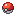
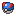

# Energie

L’énergie, c’est la jauge qui t’accompagne à chaque moment “action” sur PokeIsland. Quand tu utilises certains objets (notamment les **Poké Balls** pour capturer), tu consommes de l’énergie. Pas d’énergie = pas de capture


**Les règles de base**

* **Énergie max** : 100 par défaut
* **Recharge automatique :** +1 énergie/minute
* **Recharge hors-ligne :** oui, tu continues à en gagner même quand tu n’es pas connecté
* **Bonus avec le niveau** : tu récupères le maximum d’énergie en augmentant ton niveau

Quand tu passes au niveau supérieur, ton énergie est restaurée à 100.


### Combien coûte une Poké Ball ?

Chaque Poké Ball consomme un certain montant d’énergie (configurée côté serveur). Voici les valeurs principales :

<table><thead><tr><th width="255">Poké Ball</th><th>Coût énergie</th></tr></thead><tbody><tr><td></td><td>2</td></tr><tr><td></td><td>3</td></tr><tr><td></td><td>5</td></tr><tr><td></td><td>3</td></tr><tr><td></td><td>4</td></tr><tr><td></td><td>50</td></tr></tbody></table>

### Récupérer de l’énergie

Tu peux recharger ton énergie avec des **consommables**.

*  : **+20 énergie**
*  : **+50 énergie**
* .png>) : **+80 énergie**

### Où trouver des recharges ?

Les trois formats de recharge tombent régulièrement :

* dans les récompenses de [Dresseur](dresseur.md), dès le niveau 6 et de plus en plus souvent ensuite ;
* dans les [Rewards](economie/rewards.md) de temps de jeu ;
* à la [Boutique](boutique.md).


Pense à ton énergie **avant** de partir chasser un [légendaire](../cobblemon/pokemon/legendaires.md) : une Master Ball coûte **50 énergie** à elle seule, et une apparition ne dure que 15 minutes. Arriver à sec, c'est regarder le Pokémon disparaître.

