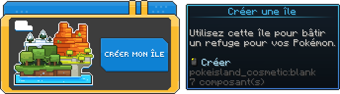

# Île joueurs

**Tu n'as toujours pas d'île ? Pas de panique je vais t'aider !** \
Tu peux obtenir une île très facilement en faisant la commande <kbd>**/is create**<kbd>

<figure><figcaption></figcaption></figure>

## Pour commencer

Dans un premier temps, tu dois connaître quelques commandes qui t'aideront pour naviguer avec l'interface de ton île.

<table><thead><tr><th width="140">Commande</th><th>Description</th></tr></thead><tbody><tr><td>/is</td><td><strong>Menu principal</strong> de l'île</td></tr><tr><td>/is go</td><td>Se <strong>téléporter</strong> à l'île</td></tr><tr><td>/is upgrade</td><td><strong>Améliorer</strong> le niveau de l'île</td></tr><tr><td>/is members</td><td>Liste des M<strong>embres</strong> de l'île</td></tr><tr><td>/is settings</td><td>Paramètres de l'île</td></tr><tr><td>/is bank</td><td><strong>Banque</strong> de l'île</td></tr><tr><td>/is warps</td><td>Accéder au <strong>Warps publique</strong> des joueurs</td></tr><tr><td>/is permissions</td><td>Gérez les <strong>Permissions</strong> de l'île</td></tr></tbody></table>

### Gestions membres

<table><thead><tr><th width="279">Commande</th><th>Description</th></tr></thead><tbody><tr><td>/is invite <mark style="color:$primary;"><code>Pseudonyme</code></mark></td><td><strong>Inviter</strong> un joueur</td></tr><tr><td>/is kick <mark style="color:$primary;"><code>Pseudonyme</code></mark></td><td><strong>Renvoyé</strong> un joueur</td></tr><tr><td>/is join <mark style="color:$primary;"><code>Nom</code></mark></td><td><strong>Rejoindre une</strong> île</td></tr><tr><td>/is promote <mark style="color:$primary;"><code>Pseudonyme</code></mark></td><td><strong>Promouvoir</strong> un joueur</td></tr><tr><td>/is demote <mark style="color:$primary;"><code>Pseudonyme</code></mark></td><td><strong>Rétrograder</strong> un joueur</td></tr><tr><td>/is ban <mark style="color:$primary;"><code>Pseudonyme</code></mark></td><td><strong>Bannir</strong> un joueur</td></tr><tr><td>/is unban <mark style="color:$primary;"><code>Pseudonyme</code></mark></td><td><strong>Pardonner</strong> un joueur</td></tr><tr><td>/is close</td><td><strong>Ferme</strong> l'accès à ton île</td></tr><tr><td>/is open</td><td><strong>Ouvre</strong> l'accès à ton île</td></tr><tr><td>/is expel <mark style="color:$primary;"><code>Pseudonyme</code></mark></td><td><strong>Expulse</strong> un joueur de l'île</td></tr></tbody></table>

### Divers

<table><thead><tr><th width="223">Commande</th><th>Description</th></tr></thead><tbody><tr><td>/is chat | /is c</td><td><strong>Active/Désactive</strong> le tchat de l'île</td></tr><tr><td>/is border</td><td><strong>Personnaliser</strong> la couleur de la bordure de l'île</td></tr></tbody></table>
