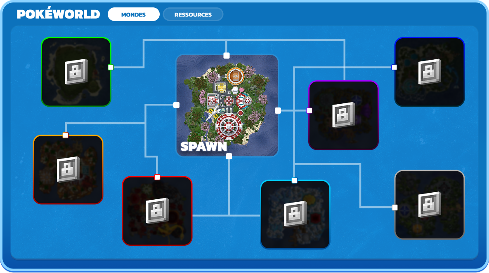

# PokéWorld

## Découvrir l'aventure du PokéWorld

Ton aventure commence  sur l'île principal du Spawn, en plus de l'île du spawn, il existe 7 autres îles avec chacune d'entre elles des spécificités précises pour ton aventure. Mais pour les découvrir tu vas devoir partir en exploration pour les débloquer dans ton menu de <kbd>**/pokeworld**</kbd>

<figure><figcaption></figcaption></figure>

**Comment ça, tu ne te sens pas d'humeur à explorer ?** \
Ca restera entre nous… Je vais t'aider pour découvrir la première île !

<strong>Comment débloquer la première île ?</strong> 🏝️

* À ton arrivée sur l’île principale du **Spawn**, avance droit devant toi jusqu’au panneau « Saute » et crée ton île.
* Puis, prends la route vers la droite en direction du dôme de l’arène. Sur ton chemin, un panneau **Vers l’aventure** se dressera devant toi : suis-le jusqu’à la plage, près des piliers en bois.
* De là, embarque sur un bateau ou plonge à la nage pour les plus téméraires et poursuis en diagonale vers l’horizon… Tu atteindras alors ta deuxième destination : **l’île Water (Eau)**.

***

### Caractéristiques des îles

Spawn

Water 

Fire

Plant

Rock

Ghost

Frozen

Mesa

