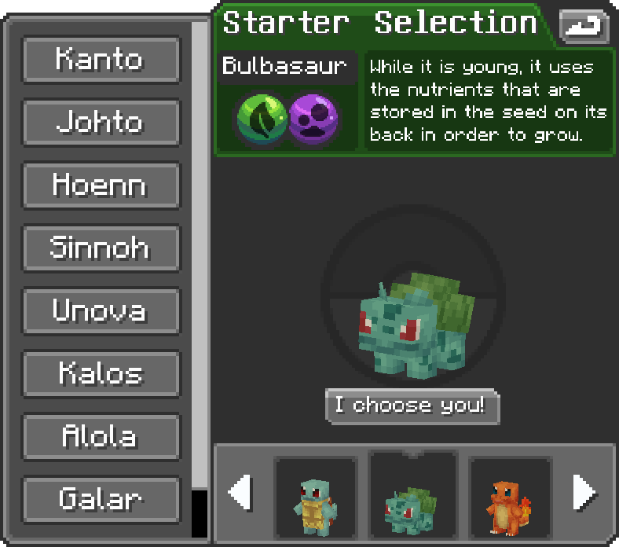

# Premier pas

Cette page te guide pas à pas depuis ta première connexion jusqu'à tes premiers combats.

***

## 1. Installer et rejoindre le serveur

PokeIsland est accessible uniquement via le **launcher officiel**. Il installe automatiquement Minecraft avec le mod Cobblemon et addons, ainsi que nos mods personnel. Pas besoin de configurer quoi que ce soit manuellement, hormis tes contrôles en jeu, chacun ses goûts.


[telechargement](../informations/telechargement/)


Tu peux aussi suivre ce tutoriel vidéo pour t'aider à rejoindre le serveur pas à pas :


Comment rejoindre PokeIsland sur Minecraft ?


***

## 2. Choisir ton starter

À ta première connexion, tu arrives sur l'île du **Spawn**. Avant de commencer ton aventure, tu dois choisir ton **Pokémon de départ** parmi les starters officiels de Cobblemon.


Ce choix est **définitif**. Les starters sont rares à trouver dans la nature alors choisis bien !


<figure><figcaption></figcaption></figure>

***

## 3. Créer ton île

Une fois ton starter en poche, avance tout droit depuis le point d'arrivée jusqu'au panneau **« Saute »** et crée ton île personnelle. C'est ta base, ton point de retour et ton espace de jeu. Sinon tu peux aussi créer ton île en faisant **/is create**


[ile-joueurs.md](../pokeisland/ile-joueurs.md)


***

## 4. La commande essentielle : `/menu`

Elle centralise toutes les interfaces clés du jeu en un seul endroit.

<table><thead><tr><th width="147">Interface</th><th>Description</th></tr></thead><tbody><tr><td><code>/pokeworld</code></td><td>Carte des îles du PokéWorld à explorer</td></tr><tr><td><code>/is</code></td><td>Gestion de ton île personnelle</td></tr><tr><td><code>/rangs</code></td><td>Consulter et progresser dans les rangs</td></tr><tr><td><code>/chasse</code></td><td>Système de chasse de Pokémon spécifiques</td></tr><tr><td><code>/boutique</code></td><td>Boutique en jeu</td></tr><tr><td><code>/enchere</code></td><td>Système d'enchères entre joueurs</td></tr><tr><td><code>/vote</code></td><td>Voter pour soutenir le serveur et gagner des récompenses</td></tr></tbody></table>


Toutes ces interfaces sont accessibles depuis `/menu` tu n'as pas besoin de mémoriser chaque commande individuellement.


***

## 5. Partir à l'aventure

Le monde de PokeIsland s'articule autour du **PokéWorld** : un archipel de 8 îles à explorer, chacune avec ses arènes, ses safaris et ses secrets.

Pour débloquer ta première île, prends la route vers la droite en direction du dôme de l'arène depuis le Spawn. Un panneau **Vers l'aventure** t'indiquera la plage de départ. Embarque sur un bateau en direction de **l'île Water**.


[pokeworld](../pokeisland/pokeworld/)



Chaque île que tu découvres est enregistrée dans ton menu `/pokeworld`.


***

## 6. Le système de dresseur

Toutes tes actions sur le serveur te rapportent de l'**EXP dresseur** et font progresser ton niveau. C'est ce niveau qui débloque les arènes, les zones et les récompenses au fil de ton aventure.


[dresseur.md](../pokeisland/dresseur.md)


***

Et bien on dirait qu'une personne ici à un monde rempli de Pokémon et d'aventure épique à découvrir.. Et ce n'est pas moi dont je parle ! Alors qu'est-ce que tu attends pour foncer et explorer PokeIsland ? Aller à plus tard, jeune dresseur, on se reverra bientôt !
